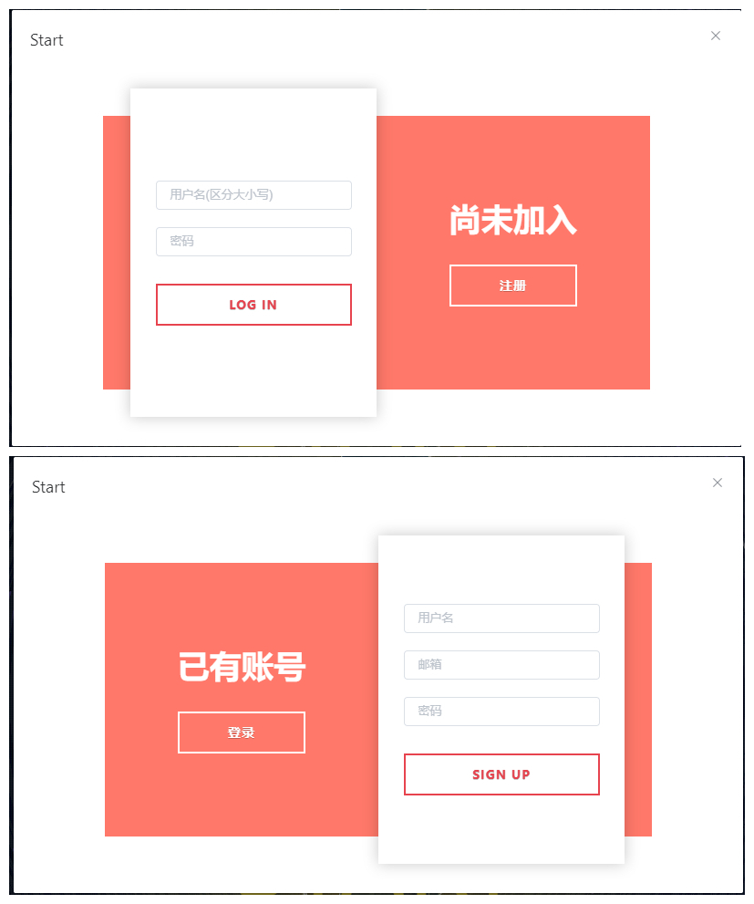
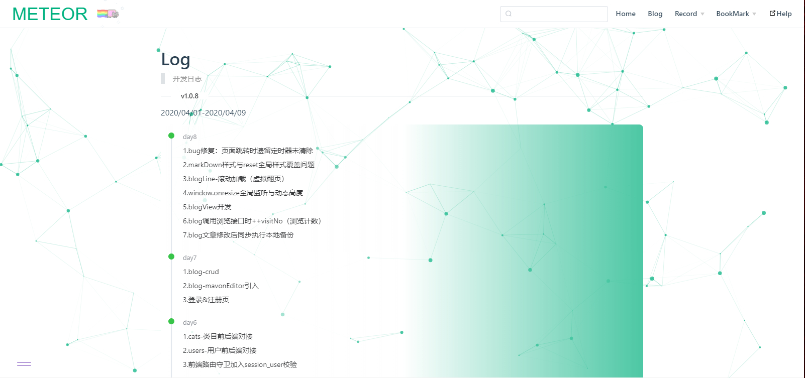

# meteor
>记博客工程从设计到落地

## 0.Script

### 前端开发

Project setup
```
npm install
```

Compiles and hot-reloads for development
```
npm run serve
```

Compiles and minifies for production
```
npm run build
```

Lints and fixes files
```
npm run lint
```

---

## 1.分析

### 1.1问题
原先用`vuepress`构建静态博客工程之后，在个性化主题改造上花费的时间远远比博客文章的攥写要多，实为**本末倒置**。

而且静态类博客在更新后总是需要本地跑一次命令以得到新的静态页面，**操作繁琐**稍感不便。

而且博客搭建或者主题开发本身也有一定的**技术门槛**。

总的来说，静态博客不太契合我的需求。

### 1.2解析
首先个人博客主要是个人使用，作为个人展示和资料归档。

而我的真实需求则更偏向于个人应用：在思否等平台上写文章做分享，在个人博客里归档整理和以及满足个性化需求。

因为本职属于前端，所以对于应用的挑剔会比较怪异和容易钻牛角尖。

同时也因为开发经验的问题，在实际落地中总会有各种问题产生而连带影响写博客的坚持度。

### 1.3期望
- 免费白嫖最好
- 数据存储更安全可信
- 文章攥写与发布能更快捷
- 高度个性化的同时有明确的优先级

### 1.4宗旨
- foolish design
- focus on doc
- free blog

### 1.5方案
#### 方案一
Plan1(纯前端):在git上开辟仓库存储博客文章，然后创建一个静态页面站点动态地利用GitHub-api从github上拉取博客文章并展示。
静态页面站点的前端开发计划由博客数驱动，每20个增量启动一批开发计划，循序渐进，由博客数驱动前端开发。

- 利
    - 白嫖数据库和服务器
- 弊
    - 数据存储相对而言不太安全
    - 且博客地址与路由文件的同步处理不太智能

#### 方案二
Plan2(全栈):博客文章本地攥写本地保存，另构建相应数据库存储博客站点的各类数据，后端提供各类服务调用，
前端分别实现个人博客站点和博客管理平台，最后内网穿透暴露到外网访问。开发进度还是同方案一由博客数驱动。
- 利
    - 数据存储安全可靠，文章发布更便捷智能
- 弊
    - 开发周期大大增加
    - 有必要考虑后端安全
    - 高并发（不考虑）

**最终确认选择`方案二`。**

## 2.细化

### 2.1思路设计

确认目标
- 本地数据库
- 博客前后端
- 本地文章备份

确认需求
- 博客可视化管理
- 博客展示带类目、标签
- 提供书签收集功能
- 提供记录（追剧/书进度、车票记录...）功能

流程简述

- 本地前后端服务常驻
- 博客管理平台新建与管理文章并同步更新数据库
- 博客前端调用后端渲染

开发模式
- 优雅降级（优先针对Chrome-pc）
- 博客数驱动设计，设计驱动前端，前端驱动后端

技术方案
- 前端脚手架 vue-cli4.2
- 前端 vue(vuex/router)+element-ui
- 前端请求 axios
- 前端样式预处理语言 less
- 前端markdown编辑器 mavon-editor
- 后端 node+express
- 后端swagger swagger-ui-express+swagger-jsdoc
- 后端日志 express-winston
- 数据库 MongoDB
- 图床 PicGo+github
- 网络 内网穿透

### 2.2要素拆解

```markdown

- 物理空间
    - doc 文章备份目录
    - service 后端开发目录
    - src 前端开发目录
- 前端
    - 开始页 √
    - 404页
    - Empty组件
    - 博客站点
        - 页首 √
            - 页首搜索功能
        - 页脚 √
            - 协议版权 √
            - 应用信息 √
            - 开发者信息 √
        - 首页 √
            - 悬浮翻转对联 √
            - 动漫-死神-背景 √
            - 像素打印动画 √
        - 博客页 √
            - 博客类目树 √
            - blog查看窗口开发 √
            - blog分享页开发
            - 浏览数 √
            - 无限滚动列表 √
            - 点赞文章
            - 分享链接
            - 快照截图
            - 评论功能
        - 书签页 √
            - 三类书签数据导入 √
            - 首字母快速检索
        - 记录页
            - log-开发日志 √
            - 多媒体（书籍、动漫、影视剧）进度记录 开发
            - 票据（车票）使用记录 开发
        - 个人信息页
        - 加载态
    - 管理平台 √
        - 页首 √
            - 每日一诗 √
        - 页脚 √
            - 音乐播放器
        - 博客管理
            - 标签词云
            - 博客备份文件默认命名（日期_文件名) √
        - 用户管理 √
            - 密码强度检测
            - 随机生成头像
        - 标签管理 √
        - 书签管理 √
        - 类目管理 √
            - 拖拽顶点
            - 排序
        - 导入
        - 导出
    - 其他
        - 多屏端适配（@media）
        - 浏览器兼容（主要适配safari）
        - 引入 element-scroll 滚动条 √
        - 侧边进度条
        - 回到顶部 √
        - 背景粒子动画particles √
        - 地理位置获取 √
        - 当地日出日落时间获取 √
        - 天气获取
    - ...
- 后端
    - user-CRUD √
    - cats-CRUD √
    - tag-CRUD √
    - blog-CRUD √
        - 更新文章同时本地备份md文件 √
        - 根据blog/tags标签生成词云
    - bookmark-CRUD √
    - record/media-CRUD
    - record/ticket-CRUD
    - record/log √
    - 成功/异常日志输出 √
    - 增删改接口session请求校验
- 数据库
    - conf_user √
    - conf_tag √
    - conf_cats √
    - conf_blog √
    - conf_bookmark √
    - conf_ticket
    - conf_media
    - conf_session
```

```前端目录
  - src
    - api   //  请求类
        - ...user/cats/tags.js //  博客后端api
        - extend.js //  第三方api
        - index.js
    - assets    //  静态资源（样式）
        - style
            - reset.less    // 样式重置
            - common.less   //  常用样式（居中，特效动画）
            - var.less  //  定义全局变量
    - components    //  组件
    - config    //  配置
    - plugin    //  插件
    - router    //  路由
    - store     //  vuex
    - util      //  工具
    - views     //  页面
        - admin
            - model
                - ...AdBlog/AdUser/AdCats.vue    //  管理页
                - AdUnit.vue    //  通用CRUD组件
            - Admin.vue     //  管理页模板
        - front
            - blog
            - bookmark
            - home
            - record
        - start
        - share
    - App.vue   //  程序主视图
    - main.js   //  程序入口
    - registerServiceWorker.js  //  pwa后续用到，先留着
```

```后端目录
    - service
        - config    //  配置
        - lib   //  工具
        - logs  //  日志
            - logs.log  //  开发日志
            - error.log //  错误日志
            - success.log   //  成功日志
        - middlewares   //  中间件
            -   checkUser //    检测用户session（未使用）
        - models    //  数据模型
        - public    //  静态资源（未使用）
        - routes    //  路由层 controller
        - swagger   //  swagge插件配置
        - views     //  视图页面（未使用）
        - app.js    //  服务入口

```

### 2.3 截图

- 开始页-白天


- 开始页-黑夜


- 登录页



- 首页


- 页脚


- 博客页


- 书签页


- 开发日志



- 管理页


- 博客管理


- markdown编辑器


- 类目树管理


## 3.开发进度_最后更新：`2020/04/09`
> [开发日志](https://github.com/Mulander-J/meteor/blob/master/explain/log.md)  

[预]C2_二世纪元
- 增删改接口加入用户session校验
- 内网穿透

C1_一世纪元 `2020/04/01-2020/04/09`

- 数据库构建
- 后端部分逻辑开发
- 前端管理平台开发
- 前端博客平台接口对接

C0_零纪元 `2020/03/17-2020/03/31`

- 相关技术点回顾与深入
- 博客设计
- 前端部分场景
---